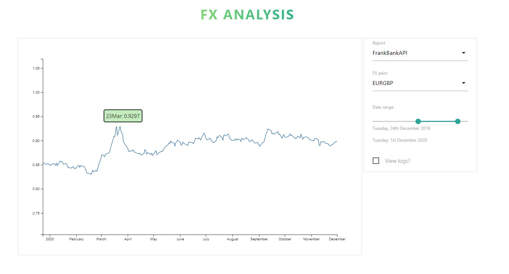

# fx-analysis

Sources fx data asynchronously from a REST API and displays in a D3 chart based on user-entered filters e.g. fx pair.

[Live example](https://xenodochial-hugle-c67805.netlify.app/)



#### Version: 1.0.1

---

### 🌟 Features & technologies

- Sources FX data from a REST API via asynchronous requests.
- D3 chart updates when response is received back.
- React component-based UI
- State management using Redux.

---

### ⚙ Installation & Running

```sh
$ npm install
```

```sh
$ npm start
```

---

### 🤔 Usage

#### 1. Update config of REST API and Chart options

The file src/config.json covers all config.

#### 2. D3 charts

D3 charts are defined as classes and saved in the src/charts directory.
